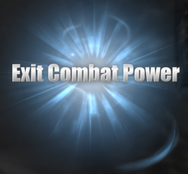

# Exit Combat Power

A Skyrim: Special Edition mod by Mark E. Kraus.

My mods:

* [Barstool Brawler](https://www.nexusmods.com/skyrimspecialedition/mods/61354)
* [Chairhammers - Chair Warhammers](https://www.nexusmods.com/skyrimspecialedition/mods/61304)
* [Chairrows - Chair Arrows](https://www.nexusmods.com/skyrimspecialedition/mods/61168)
* [Cheat Jewelry](https://www.nexusmods.com/skyrimspecialedition/mods/58973)
* [Cheat Powers](https://www.nexusmods.com/skyrimspecialedition/mods/58892)
* [Exit Combat Power](https://www.nexusmods.com/skyrimspecialedition/mods/58651)
* [Sentient Chairs of Skyrim (SCOS)](https://www.nexusmods.com/skyrimspecialedition/mods/59604)

## About Exit Combat Power

This mod adds the 'Exit Combat' and 'Exit Combat (Target)' powers to the player that will allow the player to exit combat. This works similar to the Sneak level 100 perk 'Shadow Warrior' but also runs a script to exit combat more firmly. If you are near an enemy that you are supposed to be in combat with, combat will reengage. This is meant to help when you are far away from an enemy but combat will not end.

I created the mod because I was constantly getting stuck in combat due to a combination of mods interacting poorly. Combining [Amazing Follower Tweaks SE](https://www.nexusmods.com/skyrimspecialedition/mods/6656) with [Ordinator - Perks of Skyrim](https://www.nexusmods.com/skyrimspecialedition/mods/1137)'s skeleton warriors would result in my army of minions running off and agroing something random, especially when a wolf controlled by [SkyTEST - Realistic Animals and Predators SE](https://www.nexusmods.com/skyrimspecialedition/mods/1104) would run off indefinitely. No matter what I did I could never get out of combat without using the `player.stopcombatalarmonactor` console code. This power makes the process more user-friendly.

## Manual Upgrading from 1.0.1 to 2.0.0 or later

If you manually installed version 1.0.1 of this mod (this does not apply to Mod Organizer 2, Vortex, or other mod managers), before updating to 2.0.0, you will need to do the following:

* Disable the `MarkekrausExitCombatPower.esl` plugin using whatever method you usually use.
* Open the `Data` folder under your Skyrim: Special Edition installation folder.
* Delete `MarkekrausExitCombatPower.esl`.
* In `Scripts` under `Data` delete `MarkekrausExitCombatPowerQuestScript.pex`, `PowerMarkekrausExitCombatScript.pex`, and `PowerMarkekrausExitCombatTargetScript.pex`.
* In `Source\Scripts` delete `MarkekrausExitCombatPowerQuestScript.psc`, `PowerMarkekrausExitCombatScript.psc`, and `PowerMarkekrausExitCombatTargetScript.psc` (if present).
* Follow the install directions to complete upgrade.

The files to delete are:

* `Data\MarkekrausExitCombatPower.esl`
* `Data\Scripts\MarkekrausExitCombatPowerQuestScript.pex`
* `Data\Scripts\PowerMarkekrausExitCombatScript.pex`
* `Data\Scripts\PowerMarkekrausExitCombatTargetScript.pex`
* `Data\Source\Scripts\MarkekrausExitCombatPowerQuestScript.psc`
* `Data\Source\Scripts\PowerMarkekrausExitCombatScript.psc`
* `Data\Source\Scripts\PowerMarkekrausExitCombatTargetScript.psc`

## Installation

### NMM/Vortex

Download and install with Vortex and the FOMOD installer will take care of the rest.

### Manual

* Extract the Zip file.
* Copy the extracted `MarkekrausExitCombatPower.esp` and `MarkekrausExitCombatPower.bsa` files to the `Data` folder under your Skyrim: Special Edition installation folder.
* Enable the plugin using whatever method you usually use.

## User Guide

The 'Exit Combat' and 'Exit Combat (Target)' powers will be automatically added to your powers list. Magicka > Powers. Equip the 'Exit Combat' power, use the power/shout button, and you will exit combat. To make a creature exit combat, equip `Exit Combat (Target)', aim at the creature you wish to remove from combat, press the power/shout button.

## Compatibility

This mod should be compatible with everything and should not require any patches.

## Warning: Not Lore-Friendly and Combat Balance

This mod is definitely not lore-friendly.

Also, while I created this mod to help with issues in other mods, the powers could be exploited to severely unbalance combat. For example, you could run to a giant, smash it a few times with a weapon, then use 'Exit Combat (Target)' on the giant and it will stop attacking. Alternatively, 'Exit Combat' could be used to avoid dying in battle. How you use the mod is up to you.
